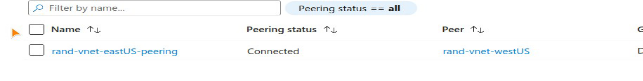
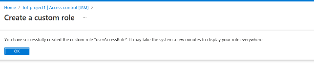

# PROJECT 1
# Azure VNet Peering and RBAC Custom Role Project

This project demonstrates the setup of a secure Azure infrastructure with VNet peering between two regions and the creation of custom RBAC roles for Rand Enterprises.

## Overview
Rand Enterprises is evaluating Azure for hosting its workloads. This project:
1. Creates virtual networks in East US and West US regions.
2. Deploys test virtual machines in both networks.
3. Establishes connectivity via VNet peering.
4. Onboards a new user and assigns a custom RBAC role.

## Objectives
- **Connect Internet Workloads**: Establish private connectivity between regions.
- **Custom RBAC Role**: Restrict user permissions to adhere to the principle of least privilege.

## Prerequisites
- Azure account with administrator access.

## Steps and Illustrations

### Step 1: Create Virtual Networks (VNet)
#### VNet 1: East US
1. Go to **Virtual Networks** > **Create**.
2. Configure as shown:
   - **Name**: `rand-vnet-eastUS`
   - **Region**: East US
   - **IP Address Range**: `192.168.0.0/16`


#### VNet 2: West US
1. Repeat the steps for the second VNet:
   - **Name**: `rand-vnet-westUS`
   - **Region**: West US
   - **IP Address Range**: `10.0.0.0/16`


---

### Step 2: Deploy Virtual Machines
#### VM 1: East US
1. Go to **Virtual Machines** > **Create**.
2. Configure:
   - **Name**: `rand-vm-eastUS`
   - **Region**: East US
   - **Virtual Network**: `rand-vnet-eastUS`


#### VM 2: West US
1. Repeat for the second VM:
   - **Name**: `rand-vm-westUS`
   - **Region**: West US
   - **Virtual Network**: `rand-vnet-westUS`


**Summary of previous steps**

**Ressource group : fof-project1** 

** First virual network **: rand-vnet-eastUS **

**Region : east US**

**network ip : 192.168.0.0/16**

**ressource type :Virtual machine name : rand-vm-eastUS**

**private ip :** 192.168.0.4

Public ip for ssh connect : 52.170.22.70

Second virtual network **: rand-vnet-westUS**

**Region : west US network ip : 10.0.0.0/16** 

**ressource type : Virtual machine name : rand-vm-westUS**

**private ip :** 10.0.0.4

**Public ip : 104.40.27.125**

### Step 3: Establish VNet Peering
1. In **Virtual Network** for `rand-vnet-eastUS`, select **Peering** > **Add**.
2. Configure the peering connection:
   - **Name**: `east-to-west`
   - **Remote VNet**: `rand-vnet-westUS`




---

### Step 4: Test Connectivity
1. Allow ICMP traffic in both NSGs to test connectivity.
2. SSH into `rand-vm-eastUS` and ping the private IP of `rand-vm-westUS`.

```bash
ping 10.0.0.4
```


### Step 5: Create a Custom RBAC Role
Onboard a User

1. Go to Azure Active Directory > Users > Add User.
    Configure:
        Username: rand-operator
        Role: Custom RBAC Role


2.Create and Assign a Custom Role
   Go to the Resource Group > Access Control (IAM) > Add Custom Role.
    Configure:
        Name: ComputerOperator
        Permissions: Start, stop, restart VMs; read-only access to network and storage.
   
   
   
   
   Assign the role to the new user.

   

    **\*\*\*END MFOFANA\*\*\***
