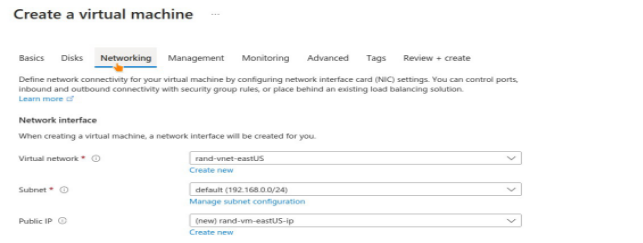

**Fofana Mahamadou**

**Connecting Internet Workloads Using Vnet Peering and Assigning a Custom Role for Operating These Workloads**

To connect Internet workloads using Vnet peering and assign a custom role for operating these workloads

**Description:** The Rand Enterprises Corporation is evaluating Azure as a deployment platform. To help the company with its evaluation, you need to create virtual networks in the region specified by Rand Enterprises Corporation. You have to create test virtual machines in two virtual networks, establish connectivity between the two networks via VNet peering, and ensure connectivity is established properly.

To test the platform, Rand Enterprises Corporation wants to onboard an employee on the company’s default Azure Active Directory and assign a Custom RBAC role, under which they will be able to read the network and storage along with the VM. Under this custom RBAC, the employee should also be given permission to start and restart the VM. You have to onboard the employee under the default Azure AD and create a custom RBAC for the role of computer operator for this employee.

As a security measure, you need to ensure that the onboarded user can only access the resources mentioned in the custom role and adhere to the principle of least privilege.

**Tools required:** Azure account with administrator access **Prerequisites:** None

**Expected Deliverables:**

- Identify the networks 
- Workload deployed to these networks 
- Establishing the connectivity between these networks 
- Onboard a user 
- Create and assign a custom role to the user. 

**1) Identify the networks** 

1. Creating first virtual nework in east US in virtual network panel click on create :

![]

2. Select your , subscription, ressource group, name, and the region as shown :

3. In IP address tab configure the first vnet’s ip space and click on create :

As shown below the first vnet in east US region is succefully created : 

4. Creating second virtual nework in west US in virtual network panel select  create :

![ref1]

5. Select your , subscription, ressource group, name, and the region as shown :

6. In IP address tab configure the second vnet’s ip space and click on create :

As shown below the second vnet in west US region is succefully created : 

**2)Workload deployed to these networks ( create test virtual machines in two virtual networks)**

1. **first test Vm in east US** :
1. : Select Vm in azure panel and select create : 

2. Follow steps to create a vm by choose the first region eastUS as below  : 

3. In networking tab, viratual network : select eastUS vnet : 

4. Follow steps and create the Vm by downloading your ***private key*** if you use a linux vm :

As shown the Vm is succefully created in eastUS : 

2. **first test Vm in east US :**
1. : Select Vm in azure panel and create a second vm in west US :

2. In networking tab, viratual network : select westUS vnet : 

3. Follow steps  and create the Vm by downloading your ***private key*** if you use a linux vm :          As shown the second Vm in  west US created :

**Summary of previous steps**

**Ressource group : fof-project1** 
**
`      `First virual network **: rand-vnet-eastUS **

**Region : east US**

**network ip : 192.168.0.0/16**

**ressource type :Virtual machine name : rand-vm-eastUS**

**private ip :** 192.168.0.4

Public ip for ssh connect : 52.170.22.70

Second virtual network **: rand-vnet-westUS**

**Region : west US network ip : 10.0.0.0/16** 

**ressource type : Virtual machine name : rand-vm-westUS**

**private ip :** 10.0.0.4

**Public ip : 104.40.27.125**

3) Establishing the connectivity between these networks
1. VNet peering
1. In virtual network panel select the first vnet as below :

2. Select peering in vnet’s side panel and click on add :

3. Give a link name for both vnest : 

4. In virtual network select the second vnet for peering ( rand-vnet-westUS ) and click Add :

` `As shown our peering is succeffuly created in two networks :

2. **Testing the connectivity of two networks :**

*I will use the vm in the first neworks in eastUS to ping the second in the westUS*

1. In network add inbound port rule allow ICMP in both Vm 

2. Using SSH to connect east US Vm and test the connectivity of two networks by a ping of the private ip of the Vm in west US region : 

**Our two vnets in different regions  are now connected succefully using peering connexion in our virtual networks.** 

4) **Onboard a user**
1. On active directory panel select Users => Add ⇒ User : 

2. Select template ( create user ) and give a username, name and password to the user and create user  : 

5) **Create and assign a custom role to the user.**
1. Custom role creation in ressource group level  :

In resource group ⇒ fof-projetc1 ⇒ Access control (IAM) ⇒ add ⇒ add custom role  as below :

2. Name the custom role : 

3. Next click on Add permissions 

   

4. Add the requested permissions in the exercise statement as below :  

6. In Assignable scopes tab, select type ==> Ressource group ==> fof-project1

Our custom role (userAccessRole ) succefully created : 

7. Now Assigning the ( userAccessRole) to our new user   In IAM ==> add, select add role assignment : 

8. Searche for our custom role  (userAccessRole) : 

9. Click on next ==> Members ==> select members : 

10. Select our user (user) in right panel : 

User selected as shown : 

11. Click on assign and the ( user is succefully assigned to our userAccessRole using RBAC and ressource group scope . 

    Detaills in IAM ==> role assignments as shown 

**\*\*\*END MFOFANA\*\*\***

[ref1]: Aspose.Words.9afeb35a-da07-4ed2-a377-ac8927ec2f3c.001.png
